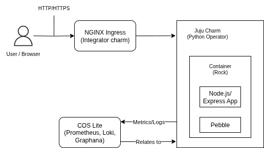

# Architecture Overview

This document explains the high-level architecture of the Charmed Node.js Boilerplate.

## React with Express Boilerplate

The UI is built using [React](https://react.dev/) and served with [Express](https://expressjs.com/), a Node.js web application framework for building applications in JavaScript.

The project implements Server-Side Rendering (SSR) through the [React SSR](https://github.com/canonical/pragma/tree/main/packages/react/ssr) package. There are two primary approaches for building and serving the application's server-side rendered version:

* **CLI-based**: The server's SSR rendered module is the entry point. Built with `bun run build:server:cli`, served with `bun run serve:cli`.
* **Middleware-based**: The server's server script is the entry point. Built with `bun run build:server:middleware`, served with `bun run serve:middleware`.

The current default behavior is to use the middleware-based approach. So, `bun run build:server` and `bun run serve` will use the middleware scripts. In the future, it is intended that the CLI-based approach will be the default, and the existing `server.ts` file will be moved to the SSR package as an example.

## System Components

The charmed Node.js application is comprised of several interacting components:

* **Node.js/Express Application:** This is the core business logic, serving the web application. It's built with Express.js for the backend API and React for the frontend user interface.
* **Juju Charm (Python Operator):** Written in Python using the `ops` framework, this operator is responsible for the lifecycle management of the Node.js application. It handles deployment, configuration, scaling, and integration with other services through Juju relations.
* **Rock (OCI Image):** The Node.js application and its runtime dependencies are packaged as an OCI-compliant image (Rock). This container image provides a portable and reproducible environment for the application.
* **Pebble:** Integrated within the Rock, Pebble acts as a lightweight daemon that manages the application's processes inside the container. The Juju charm communicates with Pebble to start/stop services, set environment variables, and manage files.
* **Kubernetes:** Provides the container orchestration platform on which the charmed application and its related services run.
* **External Services (via Juju Relations):** The application can integrate with various external services to provide full functionality and observability:
    * **PostgreSQL (or other database):** Provides persistent data storage for the application.
    * **COS Lite (Canonical Observability Stack Light):** Offers metrics collection (Prometheus) and log aggregation (Loki) for monitoring the application's health and performance.
    * **NGINX Ingress Integrator:** Exposes the application to external traffic via an ingress controller, managing routing and hostnames.

## Architecture Diagram

## Data Flow & Interactions

1.  **Incoming Requests:** User requests arrive at the NGINX Ingress controller, which routes them to the deployed `nodejs-app`.
2.  **Application Processing:** The Express.js backend handles these requests. It may interact with the PostgreSQL database for data storage and retrieval.
3.  **Observability:** The Node.js application or its charm sends metrics and logs to the `grafana-agent-k8s` which then forwards them to the COS Lite services (Prometheus for metrics, Loki for logs).
4.  **Charm-Pebble Interaction:** The Juju charm uses Pebble to manage the lifecycle of the Node.js application process within its container, ensuring it's running correctly and applying configuration changes (like database connection strings received via relation).
5.  **Juju Relations:** Integrations with PostgreSQL, COS Lite, and NGINX Ingress are established and managed through Juju relations, which automate the exchange of configuration and connection information between charms.

## Design Principles

This boilerplate is designed with several key principles in mind:

* **12-Factor App Compliance:** Encourages best practices for building robust, scalable applications, particularly in cloud environments.
* **Operational Excellence via Charms:** Leverages Juju charms for automated deployment, scaling, healing, and integration, reducing manual operational overhead.
* **Containerization (Rocks):** Uses OCI images (Rocks) for consistent and portable application packaging.
* **Observability Built-in:** Designed for easy integration with monitoring and logging solutions using COS Lite.
* **Separation of Concerns:** Distinct roles for the application, charm, and infrastructure components.

## Next Steps

With a clear understanding of the project's architecture, you can now proceed to:

* [Set up your Development Environment](../howtos/development-setup.md) to begin working with the codebase.